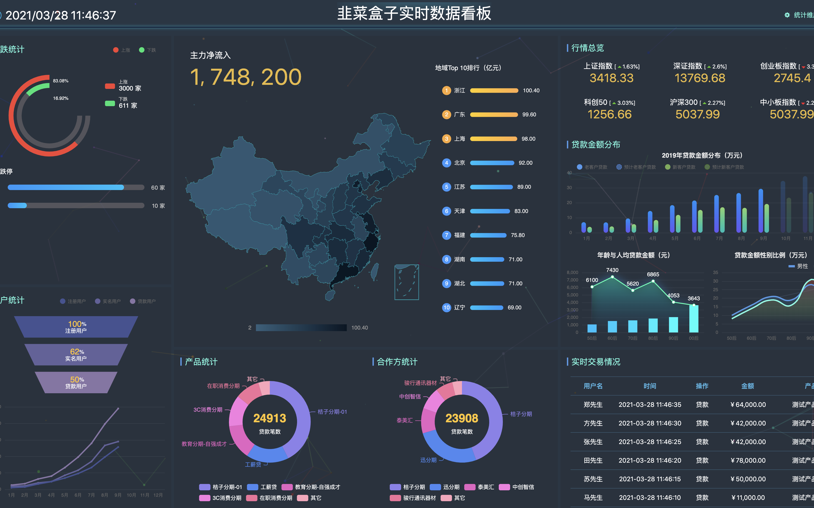

## 韭菜盒子数据大屏（WIP）

项目 Fork 于 [hzzly/credit-bi-react](https://github.com/hzzly/credit-bi-react.git)，减少重复没必要的开发工作。专注于图表设计和数据爬取展示。**欢迎PR共建**




## Setup

``` bash
# install dependencies
yarn install

# serve with hot reload at localhost:8586
yarn start
```


## 技术选型

- React 全家桶（React-Router、React-Redux、React Hooks）
- Webpack 编译打包
- Echarts 图表组件
- Grid 网格布局


### 项目结构


项目结构如下：

```tree
├── src
│   ├── assets // 资源目录
│   ├── components // 公共组件目录
│   │   ├── Card // Card组件
│   │   ├── Charts // 图表组件目录
│   │   │   ├── Bar // 柱状图
│   │   │   ├── ChinaMap // 中国地图
│   │   │   ├── Funnel // 漏斗图
│   │   │   ├── Line // 折线图
│   │   │   ├── Pie // 饼图
│   │   │   └── lib // 基础图表组件
│   │   ├── ScrollNumber // 滚动数字组件
│   │   └── SvgIcon // Icon组件
│   ├── global.scss
│   ├── index.js
│   ├── pages // 分块结构目录
│   ├── router // 路由
│   ├── store
│   │   ├── actions
│   │   ├── index.js
│   │   ├── reducers
│   │   ├── sagas
│   │   └── types.js
│   └── utils
│       ├── genChartData.js
│       ├── genMapData.js
│       ├── socket.js
│       └── util.js
```

## Contributes

欢迎PR共建。
